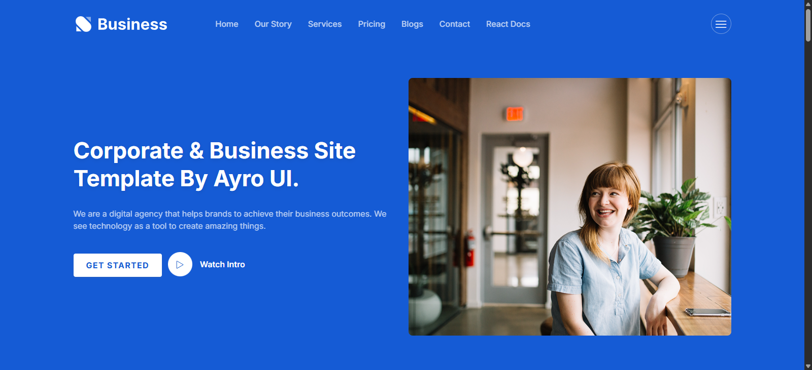
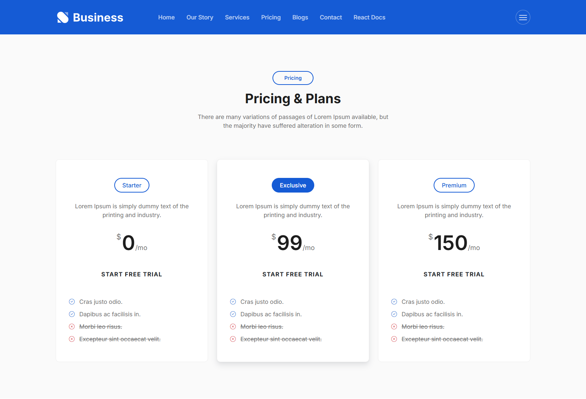

# react-web-app (React + Rest API)
 react web app 


## Overview

This project is a **React + Rest API** implementation to create SPA ( Single Page Application ):
- Each section has been managed through **components**.
- Even a component devided into **sub-components** to manage the complexity.
- The **Blog section** and **Service section** is using the API implementation using json file by the use of **axio's**.
- Tabs and the Accordion feature also used to its **FAQ section**, where I have used some other React feature's too
- like: ToDo list, Filter items, Tic Toc Toe Game, Quiz Form and Counter Timer.
- I have used the Props, States, Effect and Refs to achieve this repo. 

---

## Screenshots

**Hero/Banner Section**


**Our Story Section**


**Services Section**


**Pricing Section**


**Blogs Section**


**FAQ With other Feaures Section**


**Contact Us Section**


**Sidebar with Footer Section**


**Complete Homepage**


---

## Requirements

- Node.js & NPM


## 🛠️ Stack

- React
- Node.js

---

## Installation & Setup

1. **Clone the Repository**
   ```bash
   git clone https://github.com/shalender8928/react-web-app.git
   cd react-web-app
   ```
2. **Install PHP Dependencies**
   ```bash
   npm install
   ```
3. **Serve the Application**
   ```bash
   npm run start
   ```

## Reporting a Vulnerability

If you discover any security related issues, please drop comments. All security vulnerabilities will be promptly addressed.

## Author

Shalender Kumar  

## Links

- Blog：[https://www.codinghelpsolutions.com/](https://www.codinghelpsolutions.com/)
- GitHub：[https://github.com/shalender8928](https://github.com/shalender8928)
- LinkedIn：[https://www.linkedin.com/in/shalender8928/](https://www.linkedin.com/in/shalender8928/)


## License

react web app is open-sourced software licensed under the MIT license.